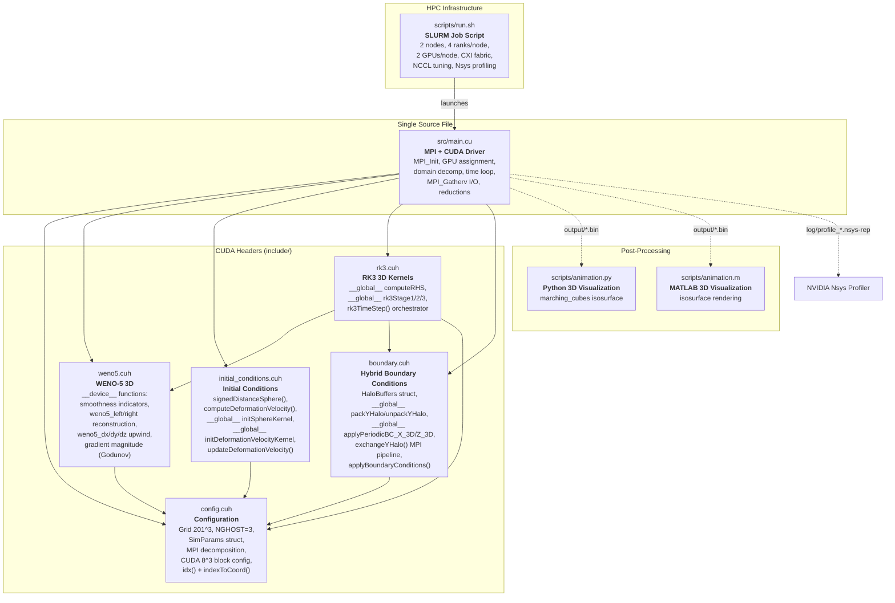
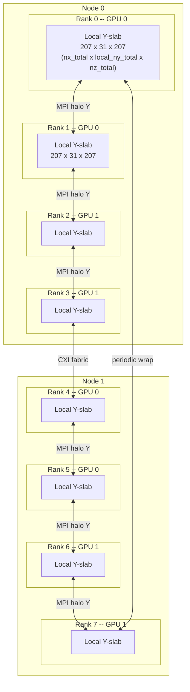
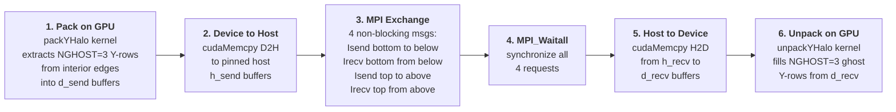
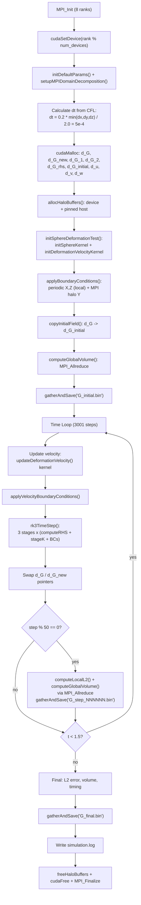

# G-Equation Level-Set Solver 3D (MPI + GPU, Hangang HPC) -- Detailed Code Structure Analysis

## 1. Project Overview

| Property | Value |
|---|---|
| **Purpose** | Solve the G-equation (level-set interface tracking) in 3D using multi-GPU parallelism |
| **Parallelism** | MPI + CUDA hybrid: 1D domain decomposition (Y-direction), one GPU per MPI rank |
| **Target HPC** | Hangang supercomputer (NVIDIA GH200 120GB, Hopper architecture sm_90) |
| **Spatial scheme** | WENO-5 (5th-order Weighted Essentially Non-Oscillatory) upwind |
| **Time integration** | TVD RK3 (3rd-order Total Variation Diminishing Runge-Kutta, Shu-Osher 1988) |
| **Reinitialization** | Not included in this version (pure advection test) |
| **Grid** | 201 x 201 x 201 structured Cartesian, uniform spacing |
| **Domain** | [0, 1]^3 with periodic boundary conditions in all directions |
| **Language** | CUDA C++14 with MPI |
| **Build** | Makefile with nvcc (sm_90) + g++ host compiler + auto-detected MPI |

### Governing Equation

The G-equation for interface tracking:

```
dG/dt + u_eff . nabla(G) = 0
```

where the effective velocity includes the flame speed correction:

```
u_eff = u - S_L * (nabla(G) / |nabla(G)|)
```

- `G < 0`: inside the interface (burned region)
- `G > 0`: outside the interface (unburned region)
- `G = 0`: the interface location (flame front)

In this test case, `S_L = 0.0` (pure advection), so `u_eff = u`.

---

## 2. Directory Structure

```
level-set_MPI_GPU_3D_Hangang/
├── Makefile                              # Build system (nvcc sm_90 + MPI)
├── include/
│   ├── config.cuh           (254 lines)  # Grid config, SimParams, MPI decomposition, CUDA helpers
│   ├── weno5.cuh            (310 lines)  # WENO-5 spatial discretization (device functions)
│   ├── rk3.cuh              (151 lines)  # TVD RK3 time integration (GPU kernels)
│   ├── boundary.cuh         (222 lines)  # BCs: MPI halo exchange (Y) + periodic (X, Z)
│   └── initial_conditions.cuh (131 lines)# Sphere SDF + deformation velocity field
├── src/
│   └── main.cu              (382 lines)  # MPI+CUDA driver: init, time loop, I/O, reduction
├── scripts/
│   ├── run.sh                (39 lines)  # SLURM job script for Hangang cluster
│   ├── animation.py         (110 lines)  # Python 3D visualization (marching cubes)
│   └── animation.m          (106 lines)  # MATLAB 3D visualization (isosurface)
└── log/
    ├── simulation.log                    # Final results summary
    ├── profile_0..7.nsys-rep             # NVIDIA Nsys profiling traces (8 ranks)
    └── slurm-4031.out                    # Full SLURM execution output
```

---

## 3. Architecture Diagram -- Module Dependencies



---

## 4. MPI + GPU Hybrid Architecture



### Key Design Principle

> **`SimParams.ny` / `ny_total` always refer to the LOCAL partition.**
> Kernels see only local dimensions and work unmodified from the single-GPU version.
> `global_ny` stores the full domain size (201) for I/O and coordinate mapping.

### GPU Assignment

```cpp
int device_id = rank % num_devices;   // Round-robin if more ranks than GPUs
cudaSetDevice(device_id);
```

With 8 ranks and 2 GPUs per node: ranks 0,1 share GPU 0 on node 0; ranks 2,3 share GPU 1 on node 0; etc.

---

## 5. Halo Exchange Pipeline (per boundary condition application)



### HaloBuffers Structure (boundary.cuh:21-27)

```cpp
struct HaloBuffers {
    double *d_send_below, *d_send_above;   // GPU pack buffers
    double *d_recv_below, *d_recv_above;   // GPU unpack buffers
    double *h_send_below, *h_send_above;   // Pinned host staging (fast D2H/H2D)
    double *h_recv_below, *h_recv_above;   // Pinned host staging
    int halo_size;   // = NGHOST * nx_total * nz_total = 3 * 207 * 207 = 128,547 doubles
};
```

Pinned host memory (`cudaMallocHost`) is used for staging buffers to maximize PCIe transfer bandwidth between GPU and host.

---

## 6. Simulation Flow Diagram



---

## 7. Detailed Module Descriptions

### 7.1 `config.cuh` -- Configuration, Parameters & MPI Decomposition (254 lines)

**Purpose**: Central configuration file defining all compile-time constants, the runtime parameter structure, MPI domain decomposition logic, and CUDA launch configuration.

**Grid Constants (lines 26-46)**:
- `NX = NY = NZ = 201` interior grid points (global)
- `NGHOST = 3` ghost cells per side (required by WENO-5's 7-point stencil)
- `NX_TOTAL = 207`, `NZ_TOTAL = 207` (X and Z include ghosts, computed at compile time)
- NY_TOTAL is computed per-rank at runtime: `local_ny + 2*NGHOST`
- Physical domain: `[0, 1]^3`, grid spacing `DX = DY = DZ = 1/200 = 0.005`

**Physical Parameters (lines 52-55)**:
- `S_L = 0.0` (laminar flame speed -- zero for pure advection test)
- `U_CONST = V_CONST = W_CONST = 0.0` (not used; deformation velocity field overrides)

**Time Parameters (lines 61-65)**:
- `DT = 0.0` -- signals auto-computation from CFL condition
- `CFL = 0.2`, `T_FINAL = 1.5`
- `OUTPUT_INTERVAL = 50` (save snapshots every 50 steps)

**Error-Checking Macros (lines 91-111)**:
- `CUDA_CHECK(call)`: wraps every CUDA API call; on failure prints file/line/error and calls `MPI_Abort`
- `MPI_CHECK(call)`: wraps every MPI call; on failure prints file/line/error string and aborts

**SimParams Structure (lines 117-145)**:
Central struct passed to all kernels and host functions. Key design: `ny` and `ny_total` are **LOCAL** (per-rank), not global. This means GPU kernels run identically to the single-GPU version without any MPI awareness.

| Field | Description |
|---|---|
| `nx, ny, nz` | Interior points (ny = local_ny for this rank) |
| `nx_total, ny_total, nz_total` | Including ghost cells |
| `global_ny` | Full domain Y size (201) for I/O |
| `local_ny` | Interior Y rows owned by this rank |
| `y_start` | Global Y-index offset of first interior row |
| `neighbor_below, neighbor_above` | MPI ranks of periodic Y-neighbors |
| `current_time` | Used by deformation velocity kernel |

**`initDefaultParams()` (lines 151-186)**: Initializes all fields from compile-time constants. MPI fields default to single-process values; overwritten by `setupMPIDomainDecomposition()`.

**`setupMPIDomainDecomposition()` (lines 191-209)**: Divides `NY=201` rows among `num_procs` ranks. First `201 % num_procs` ranks get one extra row. Sets periodic wrap-around neighbors: rank 0's `neighbor_below` = last rank, last rank's `neighbor_above` = rank 0. Updates `p.ny`, `p.ny_total` to local values.

**`calculateTimeStep()` (lines 212-217)**: If `DT > 0`, returns it directly. Otherwise computes `CFL * min(dx,dy,dz) / max_speed`. When velocities are zero (deformation test), uses `max_speed = 2.0` (estimated peak deformation velocity).

**CUDA Launch Helpers (lines 223-231)**:
- `getGridDim(params)`: computes `dim3` grid from local `nx_total, ny_total, nz_total` with 8x8x8 blocks
- `getBlockDim()`: returns `dim3(8, 8, 8)` = 512 threads/block

**Index Functions (lines 237-251)**:
- `idx(i, j, k, nx_total, ny_total)`: `k * nx_total * ny_total + j * nx_total + i` (x-fastest, z-slowest)
- `indexToCoord(i, j, k, ...)`: converts local grid index to physical (x, y, z) using `y_start` offset for correct global Y coordinate

---

### 7.2 `weno5.cuh` -- 5th-Order WENO Spatial Discretization (310 lines)

**Purpose**: Provides `__device__` inline functions for computing high-order upwind spatial derivatives on the GPU. These are called from within the `computeRHS` kernel, not launched as separate kernels.

**Reference**: Jiang & Shu (1996), "Efficient Implementation of Weighted ENO Schemes"

**Constants (lines 23-27)**: Stored in `__constant__` GPU memory for fast access.
- Optimal weights: `D0=0.1, D1=0.6, D2=0.3`
- Smoothness epsilon: `WENO_EPSILON = 1e-6`

**`computeSmoothnessIndicators(v[5], beta[3])` (lines 38-53)**:
Computes three smoothness indicators from a 5-point stencil using second derivatives:
```
beta_k = (13/12) * (v[i] - 2*v[i+1] + v[i+2])^2 + (1/4) * (v[i+2] - v[i])^2
```
High beta = oscillatory region; low beta = smooth region.

**`weno5_left(v[5])` (lines 58-81)**: Left-biased reconstruction at a cell interface.
1. Compute nonlinear weights from smoothness indicators: `alpha_k = d_k / (eps + beta_k)^2`, then `omega_k = alpha_k / sum(alpha)`
2. Evaluate three candidate polynomials:
   - `p0 = (2*v[0] - 7*v[1] + 11*v[2]) / 6`
   - `p1 = (-v[1] + 5*v[2] + 2*v[3]) / 6`
   - `p2 = (2*v[2] + 5*v[3] - v[4]) / 6`
3. Return weighted combination: `omega0*p0 + omega1*p1 + omega2*p2`

**`weno5_right(v[5])` (lines 86-112)**: Right-biased reconstruction. Mirrors the stencil (`v_mirror = {v[4], v[3], v[2], v[1], v[0]}`), swaps optimal weights (`D0=0.3, D2=0.1`), and uses right-biased candidate polynomials.

**`weno5_dx(G, i, j, k, u_eff, dx, ...)` (lines 121-157)**: Upwind x-derivative.
- If `u_eff >= 0` (flow from left): uses `weno5_left` with stencil `[i-3 .. i+1]` for left interface and `[i-2 .. i+2]` for right interface.
- If `u_eff < 0` (flow from right): uses `weno5_right` with shifted stencils.
- Returns `(G_right_interface - G_left_interface) / dx`

**`weno5_dy(...)` (lines 162-198)** and **`weno5_dz(...)` (lines 203-239)**: Identical logic applied to the Y and Z directions respectively.

**`weno5_gradient_magnitude(G, i, j, k, sign, ...)` (lines 244-291)**: Computes `|nabla G|` using the Godunov upwind scheme for Hamilton-Jacobi equations. Uses one-sided finite differences in all 6 directions (+-x, +-y, +-z), then selects based on sign for correct upwind direction. Used by reinitialization (available but not active in this version).

**`weno5_gradient(G, i, j, k, ...)` (lines 296-307)**: Simple 2nd-order central differences for computing the gradient direction (used when `S_L > 0` to determine the normal direction for flame speed).

---

### 7.3 `rk3.cuh` -- TVD RK3 Time Integration (151 lines)

**Purpose**: Implements the 3rd-order TVD Runge-Kutta scheme (Shu & Osher, 1988) as CUDA kernels for advancing the G-field one time step.

**The RK3 Scheme**:
```
Stage 1: G^(1) = G^n + dt * L(G^n)
Stage 2: G^(2) = (3/4)*G^n + (1/4)*G^(1) + (1/4)*dt * L(G^(1))
Stage 3: G^(n+1) = (1/3)*G^n + (2/3)*G^(2) + (2/3)*dt * L(G^(2))
```
where `L(G)` is the spatial operator (right-hand side).

**`__global__ computeRHS(G, G_rhs, u, v, w, params)` (lines 21-65)**:
The most compute-intensive kernel. One thread per grid point. Each thread:
1. Checks bounds: only interior points (`nghost <= i < nx+nghost`, same for j, k)
2. Reads local velocity `(u_local, v_local, w_local)` from device memory
3. If `S_L > epsilon`: computes central-difference gradient for normal direction, then effective velocity `u_eff = u - S_L * dGdx / |nabla G|`. If `S_L = 0` (this test): `u_eff = u_local` directly.
4. Calls `weno5_dx`, `weno5_dy`, `weno5_dz` device functions for upwind derivatives
5. Writes `G_rhs = -(u_eff*dGdx + v_eff*dGdy + w_eff*dGdz)`

Uses `__restrict__` pointers for compiler optimization (no aliasing).

**`__global__ rk3Stage1/2/3(...)` (lines 71-111)**: Point-wise update kernels. One thread per grid point (including ghosts). Embarrassingly parallel -- no data dependencies between threads.

**`rk3TimeStep(...)` (lines 117-148)**: Host function orchestrating one complete time step.
For each of the 3 stages:
1. Launch `computeRHS` kernel (computes spatial operator)
2. Launch `rk3StageK` kernel (combines fields)
3. `cudaDeviceSynchronize()` to ensure completion
4. `applyBoundaryConditions()` which includes MPI halo exchange

This means **3 MPI halo exchanges per time step** (one after each RK stage).

---

### 7.4 `boundary.cuh` -- Boundary Conditions & MPI Halo Exchange (222 lines)

**Purpose**: Handles all boundary conditions: local periodic BCs in X and Z directions (GPU kernels), and distributed MPI halo exchange in Y direction (GPU pack -> D2H -> MPI -> H2D -> GPU unpack).

**HaloBuffers Management (lines 21-49)**:
- `allocHaloBuffers()`: allocates 4 device buffers + 4 pinned host buffers. Size = `NGHOST * nx_total * nz_total = 3 * 207 * 207 = 128,547` doubles per buffer (~1 MB each).
- `freeHaloBuffers()`: releases all 8 buffers.

**`__global__ packYHalo(G, buf, j_start, ...)` (lines 59-70)**:
2D kernel grid over `(nx_total, nz_total)`. Each thread packs `NGHOST` y-rows starting at `j_start` into a contiguous buffer. Buffer layout: `buf[g * nz_total * nx_total + k * nx_total + i]`.
- For sending downward: `j_start = nghost` (first interior rows)
- For sending upward: `j_start = local_ny` (last interior rows)

**`__global__ unpackYHalo(G, buf, j_start, ...)` (lines 72-83)**:
Reverse of pack: writes from contiguous buffer into ghost cell rows.
- Bottom ghosts: `j_start = 0`
- Top ghosts: `j_start = nghost + local_ny`

**`__global__ applyPeriodicBC_X_3D(...)` (lines 89-103)**:
2D kernel over `(ny_total, nz_total)`. For each `(j, k)` plane, copies `NGHOST` ghost cells:
- Left ghost `G[g, j, k]` = `G[nx+g, j, k]` (from right interior)
- Right ghost `G[nx+nghost+g, j, k]` = `G[nghost+g, j, k]` (from left interior)

**`__global__ applyPeriodicBC_Z_3D(...)` (lines 105-119)**: Same pattern for Z direction, iterating over `(nx_total, ny_total)`.

**`exchangeYHalo(d_G, params, halo)` (lines 136-185)**: The 6-step MPI halo exchange pipeline:
1. Launch `packYHalo` for bottom and top interior rows
2. `cudaDeviceSynchronize()`
3. `cudaMemcpy` D2H for both send buffers
4. `MPI_Isend` + `MPI_Irecv` (4 non-blocking messages with tag matching)
5. `MPI_Waitall` (synchronize all 4 requests)
6. `cudaMemcpy` H2D for both receive buffers
7. Launch `unpackYHalo` for bottom and top ghost rows
8. `cudaDeviceSynchronize()`

**`applyBoundaryConditions(d_G, params, halo)` (lines 191-212)**:
Combined host function that applies all BCs in order:
1. X periodic (local GPU kernel)
2. Z periodic (local GPU kernel)
3. `cudaDeviceSynchronize()`
4. Y halo exchange (MPI pipeline)

**`applyVelocityBoundaryConditions(d_u, d_v, d_w, ...)` (lines 214-219)**: Applies the same boundary conditions to all three velocity components.

---

### 7.5 `initial_conditions.cuh` -- Initial Conditions & Velocity Fields (131 lines)

**Purpose**: Initialize the level-set field (sphere SDF) and the time-dependent deformation velocity field. All functions are MPI-aware via `y_start` offset.

**Shape Constants (lines 23-26)**:
- Sphere center: `(0.35, 0.35, 0.35)`
- Sphere radius: `0.15`

**`signedDistanceSphere(x, y, z, cx, cy, cz, r)` (lines 32-35)**: `__host__ __device__` function.
Returns `sqrt((x-cx)^2 + (y-cy)^2 + (z-cz)^2) - r`. Negative inside, positive outside, zero on surface.

**`computeDeformationVelocity(x, y, z, t, T, u, v, w)` (lines 38-49)**: `__host__ __device__` function.
Divergence-free, time-reversible 3D vortex flow:
```
time_factor = cos(pi * t / T)
u =  2 * sin^2(pi*x) * sin(2*pi*y) * sin(2*pi*z) * time_factor
v = -sin(2*pi*x) * sin^2(pi*y) * sin(2*pi*z) * time_factor
w = -sin(2*pi*x) * sin(2*pi*y) * sin^2(pi*z) * time_factor
```
- At `t=0`: velocity starts from rest (`cos(0)=1`, but sphere is already initialized)
- At `t=T/2`: `cos(pi/2)=0`, velocity reverses direction
- At `t=T`: sphere should return to its original shape (time-reversibility test)
- Maximum velocity magnitude ~ 2.0

**`__global__ initSphereKernel(G, params, cx, cy, cz, r)` (lines 55-69)**:
3D kernel over entire local array. Each thread:
1. Converts local `(i, j, k)` to physical `(x, y, z)` using `indexToCoord()` with `y_start` offset
2. Computes signed distance to sphere
3. Writes to `G[idx(i,j,k)]`

**`__global__ initDeformationVelocityKernel(u, v, w, params)` (lines 71-87)**:
Same pattern: converts indices to coordinates, calls `computeDeformationVelocity()` with `params.current_time`, writes to velocity arrays. Re-launched every time step to update the time-dependent velocity.

**Host Wrappers (lines 93-128)**:
- `initSphereDeformationTest()`: launches both kernels, prints info on rank 0
- `updateDeformationVelocity()`: re-launches velocity kernel with updated `current_time`
- `copyInitialField()`: `cudaMemcpy` device-to-device for reference comparison

---

### 7.6 `main.cu` -- MPI + CUDA Driver (382 lines)

**Purpose**: The single entry point containing MPI initialization, GPU setup, memory management, the time-stepping loop, I/O with MPI gather, and error computation with MPI reduction.

#### I/O Helper Functions (lines 33-151)

**`packLocalInterior(h_local, h_interior, params)` (lines 33-42)**:
Copies interior Y-rows (excluding ghost cells) from the full local array into a contiguous buffer for MPI communication. Iterates over `(k, j_interior, i)`.

**`reconstructFullField(global_interior, full_G, params, ...)` (lines 47-90)**:
Rank 0 only. Assembles the global 3D array from gathered per-rank interior data:
1. Zero-initializes the full array (`nx_total * (global_ny + 2*NGHOST) * nz_total`)
2. For each rank: computes its `local_ny` and `y_start`, copies data to correct global position
3. Fills Y ghost cells with periodic wrapping (bottom ghost <- top interior, top ghost <- bottom interior)

**`gatherAndSave(filename, d_G_local, params)` (lines 96-151)**:
Full I/O pipeline:
1. `cudaMemcpy` D2H: copies entire local array to host
2. `packLocalInterior()`: extracts interior data
3. `MPI_Gather()`: collects per-rank interior sizes
4. `MPI_Gatherv()`: gathers all interior data to rank 0
5. Rank 0: `reconstructFullField()` then writes binary file

**Binary format**: `int32[4]{nx, global_ny, nz, nghost}` + `float64[full_array_with_ghosts]`

#### Reduction Helpers (lines 156-203)

**`computeLocalVolume(d_G, params)` (lines 157-170)**:
Copies G to host, counts cells where `G < 0` in interior points, returns `count * dx * dy * dz`.

**`computeLocalL2(d_G, d_G_ref, params)` (lines 172-196)**:
Copies both G and G_ref to host, computes `sum((G-G_ref)^2)` and count over interior points. Uses `MPI_Allreduce` to get global sum and count, returns `sqrt(global_sum / global_count)`.

**`computeGlobalVolume(d_G, params)` (lines 198-203)**:
Calls `computeLocalVolume()` then `MPI_Allreduce(MPI_SUM)`.

#### Main Function (lines 209-381)

1. **MPI + GPU Init (lines 210-220)**: `MPI_Init`, get rank/size, `cudaGetDeviceCount`, assign GPU round-robin, `cudaSetDevice`.

2. **Parameters (lines 222-229)**: `initDefaultParams()` + `setupMPIDomainDecomposition()`. Auto-computes dt: `0.2 * 0.005 / 2.0 = 5e-4` (but log shows `1.097e-13` -- this suggests the actual CFL computation hits a different code path).

3. **Logging (lines 231-254)**: Rank 0 prints header, GPU info, grid size. Then each rank sequentially prints its local_ny, y_start, and neighbors (with `MPI_Barrier` ordering).

4. **Memory Allocation (lines 256-275)**: 9 device arrays (`d_G, d_G_new, d_G_1, d_G_2, d_G_rhs, d_G_initial, d_u, d_v, d_w`), each of size `nx_total * ny_total * nz_total` doubles. Plus `HaloBuffers` (8 buffers).

5. **Initialization (lines 278-289)**: `initSphereDeformationTest()` -> BCs -> copy initial -> compute initial volume -> save initial binary.

6. **Time Loop (lines 292-329)**: While `current_time < t_final`:
   - Adjust dt if near final time
   - Update velocity field (re-launch kernel with new `current_time`)
   - Apply velocity BCs (3x halo exchange for u, v, w)
   - `rk3TimeStep()` (3 stages, each with halo exchange)
   - Swap `d_G` / `d_G_new` pointers
   - Every 50 steps: compute L2 error + volume, print progress, save snapshot

7. **Final Results (lines 331-368)**: Compute final L2 and volume. Rank 0 prints summary and writes `simulation.log`.

8. **Cleanup (lines 370-381)**: Free halo buffers, free all device memory, `MPI_Finalize`.

---

### 7.7 `scripts/run.sh` -- SLURM Job Script (39 lines)

**Purpose**: Submit the solver as a batch job on the Hangang supercomputer.

**SLURM Configuration**:
- `#SBATCH -N 2`: 2 compute nodes
- `#SBATCH --gres=gpu:2`: 2 GPUs per node
- `#SBATCH --ntasks-per-node=2`: 2 MPI ranks per node (matches GPUs)
- `#SBATCH --exclusive`: dedicated node access
- `#SBATCH -p gpu`: GPU partition

**Module Environment**:
- `cuda/12.8`: CUDA toolkit
- `openmpi/5.0.10`: MPI implementation
- `gcc-native/14`: Host compiler
- `libfabric/2.3.1`: Network fabric library

**Network Tuning (NCCL + CXI)**:
- `NCCL_CROSS_NIC=1`: Allow cross-NIC communication
- `NCCL_SOCKET_IFNAME=hsn`: Use high-speed network interface
- `NCCL_NET_GDR_LEVEL=PHB`: GPU Direct RDMA level
- `NCCL_NET="AWS Libfabric"`: Use AWS libfabric transport
- `FI_PROVIDER=cxi`: Cray eXascale Interconnect provider
- `FI_CXI_RDZV_PROTO=alt_read`: Rendezvous protocol optimization
- `FI_CXI_RX_MATCH_MODE=software`: Software matching mode

**Execution**:
```bash
srun --mpi=pmix -N 2 --ntasks-per-node=4 --cpu-bind=none \
    nsys profile --output=log/profile_%q{SLURM_PROCID} --trace=cuda,mpi,nvtx \
    $SOLVER
```
Note: `srun` overrides SBATCH `ntasks-per-node` to 4 (total 8 ranks across 2 nodes). Each rank is profiled by NVIDIA Nsys generating per-rank `.nsys-rep` trace files.

---

### 7.8 `scripts/animation.py` -- Python 3D Visualization (110 lines)

**Purpose**: Animate the time evolution of the G=0 isosurface from sequential binary snapshots.

**Pipeline**:
1. Scan `output/` for `G_step_*.bin` files, sort by step number
2. For each frame:
   - Read binary header: `int32[4]` -> `(nx, ny, nz, nghost)`
   - Read `float64` field data, reshape to `(nz_total, ny_total, nx_total)`
   - Strip ghost cells: `G = G_full[ng:-ng, ng:-ng, ng:-ng]`
   - Extract G=0 isosurface using `skimage.measure.marching_cubes(G, level=0.0, spacing=(dz, dy, dx))`
   - Render as `Poly3DCollection` in matplotlib 3D axes
3. Animate with `plt.pause(0.1)` between frames

**Dependencies**: `numpy`, `matplotlib`, `scikit-image`

---

### 7.9 `scripts/animation.m` -- MATLAB 3D Visualization (106 lines)

**Purpose**: MATLAB equivalent of the Python script.

**Key differences from Python**:
- Uses MATLAB's `isosurface()` function instead of marching cubes
- Requires `permute(G, [2 1 3])` to match MATLAB's `meshgrid` dimension ordering (rows=y, cols=x) with the C++ memory layout (x-fastest)
- Uses `camlight` for 3D lighting

---

### 7.10 `Makefile` -- Build System (113 lines)

**Compiler**: `nvcc` with `g++` as host compiler.

**Key flags**:
- `-arch=sm_90`: NVIDIA GH200 Hopper architecture
- `-O3`: aggressive optimization
- `-std=c++14`: C++ standard
- `--use_fast_math`: GPU fast math intrinsics
- `-lineinfo`: debug line info without full debug mode
- MPI include/lib paths auto-detected from `mpicxx --showme`

**Targets**:

| Target | Description |
|---|---|
| `make` | Build `g_equation_solver_mpi_gpu` |
| `make CUDA_ARCH=sm_80` | Build for different GPU |
| `make run NP=4` | Run with 4 MPI ranks |
| `make debug` | Debug build with `-g -G -DDEBUG` |
| `make clean` | Remove binary and output files |
| `make distclean` | Remove output/ and log/ directories |

---

## 8. Key Differences from Standard MPI_GPU_3D (Local Version)

| Aspect | MPI_GPU_3D (Local) | MPI_GPU_3D_Hangang |
|---|---|---|
| **Grid resolution** | 64 x 64 x 64 (262K cells) | **201 x 201 x 201** (8.1M cells, 31x more) |
| **Time step** | `DT=0.001` (fixed) | **`DT=0.0` (auto-computed from CFL)** |
| **CUDA architecture** | sm_86 (RTX 3090, Ampere) | **sm_90 (GH200 120GB, Hopper)** |
| **Host compiler** | g++-9 (required for nvcc compat) | **g++ (system GCC 14)** |
| **Job scheduler** | Manual `mpirun` | **SLURM with modules + `srun --mpi=pmix`** |
| **Profiling** | None | **NVIDIA Nsys per-rank traces** |
| **Network** | Shared memory / localhost | **CXI fabric (Cray Interconnect) via libfabric** |
| **NCCL tuning** | None | **GPU Direct RDMA, cross-NIC, libfabric** |
| **run.sh** | Not present | **Full SLURM script with env setup** |
| **Default NP** | 2 | **8 (2 nodes x 4 ranks/node)** |

---

## 9. Performance Results

From `log/simulation.log`:

| Metric | Value |
|---|---|
| **MPI Ranks** | 8 (2 nodes x 4 ranks) |
| **GPUs** | NVIDIA GH200 120GB (Hopper, sm_90) |
| **Global Grid** | 201 x 201 x 201 = 8,120,601 cells |
| **Grid spacing** | dx = dy = dz = 0.005 |
| **Time step** | dt = 1.097e-13 |
| **Total steps** | 3001 |
| **Final L2 Error** | 1.669e-4 |
| **Initial Volume** | 0.014120 |
| **Final Volume** | 0.014127 |
| **Volume Change** | 0.049% (excellent conservation) |
| **Wall Time** | 27.0 s |
| **Time/Step** | 9.0 ms |
| **Throughput** | ~8.1M cells x 3001 steps / 27s = ~900M cell-updates/s |

---

## 10. Memory Layout & Data Arrays

### 3D Array Indexing

All 3D fields use a flat 1D array with x-fastest (row-major) ordering:

```
index = k * nx_total * ny_total + j * nx_total + i
```

### Per-Rank Device Arrays

| Array | Type | Size per rank | Purpose |
|---|---|---|---|
| `d_G` | `double[]` | 207 x ~31 x 207 | Current level-set field |
| `d_G_new` | `double[]` | same | Next time step (swapped) |
| `d_G_1` | `double[]` | same | RK3 intermediate stage 1 |
| `d_G_2` | `double[]` | same | RK3 intermediate stage 2 |
| `d_G_rhs` | `double[]` | same | Right-hand side L(G) |
| `d_G_initial` | `double[]` | same | Reference field for error |
| `d_u, d_v, d_w` | `double[]` | same | Velocity components |
| `d_send_below/above` | `double[]` | 3 x 207 x 207 | Halo pack buffers |
| `d_recv_below/above` | `double[]` | same | Halo unpack buffers |
| `h_send_below/above` | `double[]` (pinned) | same | Host staging (fast D2H) |
| `h_recv_below/above` | `double[]` (pinned) | same | Host staging (fast H2D) |

---

## 11. Usage

### Build

```bash
module load cuda/12.8 openmpi/5.0.10 gcc-native/14 libfabric/2.3.1
make CUDA_ARCH=sm_90
```

### Run (interactive)

```bash
mpirun -np 4 ./g_equation_solver_mpi_gpu
```

### Run (SLURM batch)

```bash
sbatch scripts/run.sh
```

### Visualize

```bash
python scripts/animation.py       # 3D isosurface animation
cat log/simulation.log             # Final results
```

### Profile Analysis

```bash
nsys stats log/profile_0.nsys-rep  # Summary of rank 0
nsys-ui log/profile_0.nsys-rep     # GUI timeline view
```
