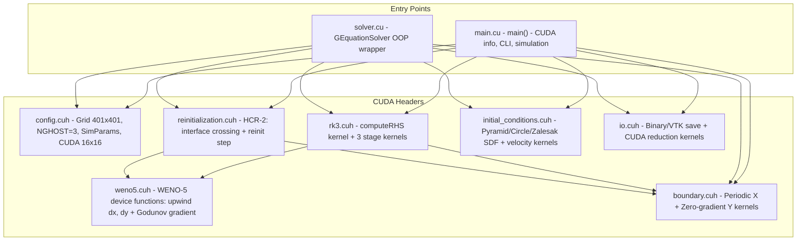
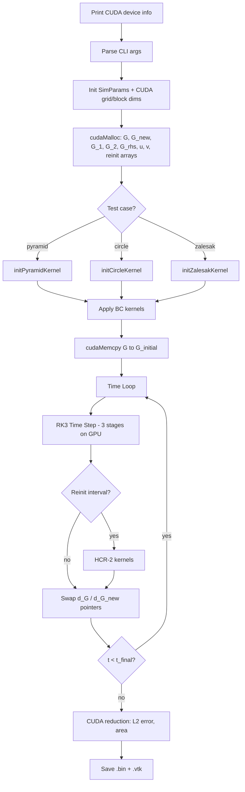

# G-Equation Level-Set Solver 2D (GPU/CUDA) -- Code Structure Analysis

## 1. Project Overview

| Property | Value |
|---|---|
| **Purpose** | Solve the G-equation (level-set interface tracking) in 2D |
| **Parallelism** | CUDA GPU (single GPU), block size 16x16 |
| **Spatial scheme** | WENO-5 (5th-order Weighted ENO) upwind |
| **Time integration** | TVD RK3 (3rd-order Shu-Osher) |
| **Reinitialization** | HCR-2 (Hartmann Conservative Reinitialization) |
| **Grid** | 401x401 structured, uniform spacing |
| **Domain** | [0, 1]^2 with Periodic BC (x) + Zero-gradient BC (y) |
| **Language** | CUDA C++14 |
| **Build** | Makefile with nvcc (sm_89) |

### Governing Equation

dG/dt + u_eff . nabla G = 0, where u_eff = u - S_L * (nabla G / |nabla G|)

- G < 0: inside (burned), G > 0: outside (unburned), G = 0: interface

---

## 2. Directory Structure

```
level-set_GPU_2D/
├── Makefile                  # Build (nvcc, sm_89, -O3, C++14, fast math)
├── g_equation_solver         # Compiled binary
├── include/
│   ├── config.cuh            # Grid, physics, numerics, SimParams, CUDA block config
│   ├── weno5.cuh             # WENO-5 spatial discretization (device functions)
│   ├── rk3.cuh               # TVD RK3 + RHS computation (CUDA kernels)
│   ├── reinitialization.cuh  # HCR-2 signed-distance recovery (CUDA kernels)
│   ├── boundary.cuh          # Periodic (x) + Zero-gradient (y) BC kernels
│   ├── initial_conditions.cuh # SDFs (pyramid, circle, Zalesak) + velocity fields
│   └── io.cuh                # Binary/VTK I/O, CUDA reduction for error metrics
├── src/
│   ├── main.cu               # CLI entry point, standalone simulation loop
│   └── solver.cu             # GEquationSolver class (OOP wrapper)
├── scripts/
│   ├── visualize.py          # Python contour plots & error metrics
│   ├── visualize.m           # MATLAB visualization
│   ├── read_level_set_binary.m
│   ├── analyze_error.m
│   └── animation.m
├── log/                      # Performance logs (201x201 ~ 1601x1601)
└── output/                   # Binary & VTK output
```

---

## 3. Architecture Diagram



---

## 4. Simulation Flow



---

## 5. Module Descriptions

### 5.1 `config.cuh` -- Configuration & Parameters
- Grid: NX=NY=401 interior + NGHOST=3 ghost -> 407x407 total
- Domain: [0,1]^2, DX=DY=1/400
- Physics: S_L=0.0, U_CONST=1.0, V_CONST=0.0
- Time: CFL=0.2, T_FINAL=2*pi, MAX_STEPS=10^6
- Reinitialization: HCR-2 with REINIT_DTAU=0.25*dx, REINIT_BETA=0.5
- CUDA: BLOCK_SIZE=16x16 (256 threads), grid auto-computed
- SimParams struct holds all runtime parameters for device access
- IDX(i,j) macro: j*nx_total + i (row-major, x-fastest)

### 5.2 `weno5.cuh` -- WENO-5 Spatial Discretization
- `__device__` inline functions (not kernels -- called from RHS kernel)
- `computeSmoothnessIndicators()`: beta[3] from 5-point stencil
- `weno5_left(v[5])` / `weno5_right(v[5])`: cell-interface reconstruction with optimal weights (0.1, 0.6, 0.3)
- `weno5_dx()`: upwind x-derivative (left-biased if u>=0, right-biased otherwise)
- `weno5_dy()`: upwind y-derivative (same logic)
- `weno5_gradient_magnitude()`: Godunov scheme for reinitialization
- `weno5_gradient()`: central difference for flame speed normal direction

### 5.3 `rk3.cuh` -- TVD RK3 Time Integration
- `__global__ computeRHS()`: evaluates -u_eff . nabla G using WENO-5 device functions
- `__global__ rk3Stage1/2/3()`: point-wise RK stage updates (embarrassingly parallel)
- `rk3TimeStep()` host function: orchestrates 3 stages, launches BC kernels after each stage
- Each kernel uses 16x16 thread blocks mapped over NX_TOTAL x NY_TOTAL grid

### 5.4 `reinitialization.cuh` -- HCR-2 Reinitialization
- Solves dphi/dtau + S(phi_0)(|nabla phi| - 1) = beta * F
- `__global__ computeInterfaceCrossings()`: detects sign changes with 4 neighbors, flags bits (1=x-, 2=x+, 4=y-, 8=y+), computes r_tilde
- `__global__ reinitStep()`: single pseudo-time step with Godunov gradient + HCR-2 forcing
- `reinitializeWithSwap()`: host function, runs reinit_iterations with pointer swapping

### 5.5 `boundary.cuh` -- Boundary Conditions
- `__global__ applyPeriodicBC_X()`: ghost copy x-direction (left<->right wrap)
- `__global__ applyZeroGradientBC_Y()`: copy nearest interior value into y-ghosts
- `applyBoundaryConditions()`: host function launches both kernels

### 5.6 `initial_conditions.cuh` -- Initial Conditions & Velocity Fields
- **Pyramid/Diamond**: |x-cx| + |y-cy| at center (0.5, 1.0), half-width 0.5
- **Circle**: sqrt((x-cx)^2 + (y-cy)^2) - r at (0.25, 0.5), r=0.15
- **Zalesak slotted disk**: max(disk_SDF, -slot_SDF) at (0.5, 0.75), r=0.15, slot 0.05x0.25
- `initConstantVelocityKernel()`, `initRotatingVelocityKernel()`

### 5.7 `io.cuh` -- I/O & Error Metrics
- Binary format: header int[3]{nx,ny,nghost} + double[nx_total*ny_total]
- `saveFieldBinary()`: cudaMemcpy D2H then fwrite
- `saveFieldVTK()`: ASCII structured points for ParaView
- CUDA reduction kernels for L2 error and interface area

### 5.8 `main.cu` -- Entry Point
- CLI: -t pyramid/circle/zalesak, -n gridsize, -T time, -cfl, -sl, -u/-v, -reinit, -o dir
- `runStandaloneSimulation()`: allocate GPU memory, init test, time loop, save, cleanup

### 5.9 `solver.cu` -- OOP Wrapper
- `GEquationSolver` class: allocateMemory(), initializeTest(), step(), run(), saveField()

---

## 6. GPU Kernel Structure

| Kernel | Block | Purpose |
|---|---|---|
| `computeRHS` | (16,16) | WENO-5 spatial operator |
| `rk3Stage1/2/3` | (16,16) | Point-wise RK update |
| `applyPeriodicBC_X` | adapted | X ghost copy |
| `applyZeroGradientBC_Y` | adapted | Y ghost fill |
| `initPyramid/Circle/ZalesakKernel` | (16,16) | SDF initialization |
| `computeInterfaceCrossings` | (16,16) | HCR-2 pre-computation |
| `reinitStep` | (16,16) | Pseudo-time iteration |
| `computeSquaredErrorKernel` | (16,16) | Error calculation |
| `reduceSum` | adapted | Parallel reduction |

---

## 7. Test Cases

| Test | Shape | Velocity | Purpose |
|---|---|---|---|
| **Pyramid** | Diamond at (0.5, 1.0) | (1, 0) constant | Pure advection |
| **Circle** | Circle at (0.25, 0.5), r=0.15 | (1, 0) constant | Convergence study |
| **Zalesak** | Slotted disk at (0.5, 0.75) | Rotation | Corner preservation + reinit |

---

## 8. Performance (from logs)

| Grid | Steps | GPU Time | Time/Step |
|---|---|---|---|
| 201x201 | 6284 | 1.85 s | 0.295 ms |

---

## 9. Usage

```bash
make
./g_equation_solver -t zalesak -T 6.283185 -reinit
./g_equation_solver -t pyramid -T 1.0 -n 201 -no-reinit
python scripts/visualize.py --compare
```
