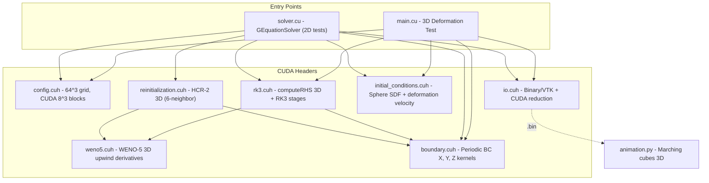

# G-Equation Level-Set Solver 3D (GPU/CUDA) -- Code Structure Analysis

## 1. Project Overview

| Property | Value |
|---|---|
| **Purpose** | Solve the G-equation (level-set interface tracking) in 3D |
| **Parallelism** | CUDA GPU (single GPU), block size 8x8x8 |
| **Spatial scheme** | WENO-5 (5th-order Weighted ENO) upwind |
| **Time integration** | TVD RK3 (3rd-order Shu-Osher) |
| **Reinitialization** | HCR-2 (Hartmann Conservative Reinitialization) |
| **Grid** | 64x64x64 structured, uniform spacing |
| **Domain** | [0, 1]^3 with periodic BCs in all directions |
| **Language** | CUDA C++14 |
| **Build** | Makefile with nvcc (sm_86) |

### Governing Equation

dG/dt + u_eff . nabla G = 0, where u_eff = u - S_L * (nabla G / |nabla G|)

---

## 2. Directory Structure

```
level-set_GPU_3D/
├── Makefile                  # Build (nvcc, sm_86, -O3, C++14, fast math)
├── include/
│   ├── config.cuh            # Grid 64^3, NGHOST=3, SimParams, CUDA 8^3 blocks
│   ├── weno5.cuh             # WENO-5 3D device functions (dx, dy, dz)
│   ├── rk3.cuh               # TVD RK3 3D kernels + RHS computation
│   ├── reinitialization.cuh  # HCR-2 3D (6-neighbor interface detection)
│   ├── boundary.cuh          # Periodic BC kernels (X, Y, Z)
│   ├── initial_conditions.cuh # Sphere SDF + 3D deformation velocity
│   └── io.cuh                # Binary/VTK I/O, CUDA reduction, error metrics
├── src/
│   ├── main.cu               # 3D deformation test entry point
│   └── solver.cu             # GEquationSolver class (includes 2D tests)
├── scripts/
│   ├── visualize.py          # Python 2D slice visualization
│   ├── animation.py          # Python 3D marching cubes isosurface
│   └── *.m                   # MATLAB scripts
└── log/ & output/
```

---

## 3. Architecture Diagram



---

## 4. Module Descriptions

### 4.1 `config.cuh` -- Configuration
- Grid: NX=NY=NZ=64 + NGHOST=3 -> 70^3 total
- Domain [0,1]^3, DX=DY=DZ=1/63
- DT=0.001 (fixed), CFL=0.2, T_FINAL=1.5
- CUDA: BLOCK_SIZE 8x8x8 = 512 threads/block
- idx(i,j,k) = k*nx_total*ny_total + j*nx_total + i

### 4.2 `weno5.cuh` -- WENO-5 3D
- Same WENO-5 core as 2D version
- 3D directional derivatives: weno5_dx(), weno5_dy(), weno5_dz()
- weno5_gradient_magnitude(): Godunov scheme with 6 one-sided differences

### 4.3 `rk3.cuh` -- TVD RK3 3D
- `__global__ computeRHS()`: 3D kernel computing -u_eff . nabla G with WENO-5
- `__global__ rk3Stage1/2/3()`: 3D point-wise updates
- rk3TimeStep(): orchestrates stages with BC after each

### 4.4 `reinitialization.cuh` -- HCR-2 3D
- 6-neighbor interface detection (bits: 1=x-, 2=x+, 4=y-, 8=y+, 16=z-, 32=z+)
- computeInterfaceCrossings kernel: r_tilde = phi_c / sum(phi_neighbors)
- reinitStep kernel: Godunov gradient + HCR-2 forcing with stability constraint

### 4.5 `boundary.cuh` -- 3D Periodic BCs
- `__global__ applyPeriodicBC_X_3D()`, `_Y_3D()`, `_Z_3D()`
- All three directions periodic
- 2D blocks (16x16) iterating over planes

### 4.6 `initial_conditions.cuh` -- 3D Init
- Sphere SDF: center (0.35, 0.35, 0.35), radius 0.15
- 3D Deformation velocity (divergence-free, time-reversible):
  - u = 2 sin^2(pi*x) sin(2pi*y) sin(2pi*z) cos(pi*t/T)
  - v = -sin(2pi*x) sin^2(pi*y) sin(2pi*z) cos(pi*t/T)
  - w = -sin(2pi*x) sin(2pi*y) sin^2(pi*z) cos(pi*t/T)
- Sphere stretches at t=T/2, returns at t=T

### 4.7 `io.cuh` -- I/O & Diagnostics
- Binary format: int[3]{nx,ny,nghost} + double array (2D format)
- CUDA error reduction: computeSquaredErrorKernel + reduceSum

### 4.8 `main.cu` -- 3D Deformation Test
- Runs sphere deformation directly (no CLI parsing)
- Time loop: update velocity -> RK3 -> snapshot every OUTPUT_INTERVAL steps

### 4.9 `solver.cu` -- 2D OOP Wrapper
- Contains GEquationSolver class for 2D test cases
- Not used by main.cu's 3D deformation test

---

## 5. GPU Kernel Structure

- Block: 8x8x8 = 512 threads
- Grid: ceil(70/8)^3 = 9^3 = 729 blocks
- WENO-5 functions are `__device__` inline (called from computeRHS)
- BC kernels use 2D blocks (16x16) iterating over planes

---

## 6. Test Case: Sphere Deformation

- Initial: Sphere at (0.35, 0.35, 0.35), r=0.15
- Velocity: divergence-free vortex, time-reversible
- At t=T/2: sphere stretched into thin filament
- At t=T=1.5: returns to original shape
- Validation: L2 error and volume conservation

---

## 7. Usage

```bash
make CUDA_ARCH=sm_86
./g_equation_solver
python scripts/animation.py
```
