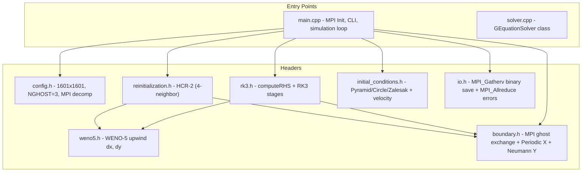
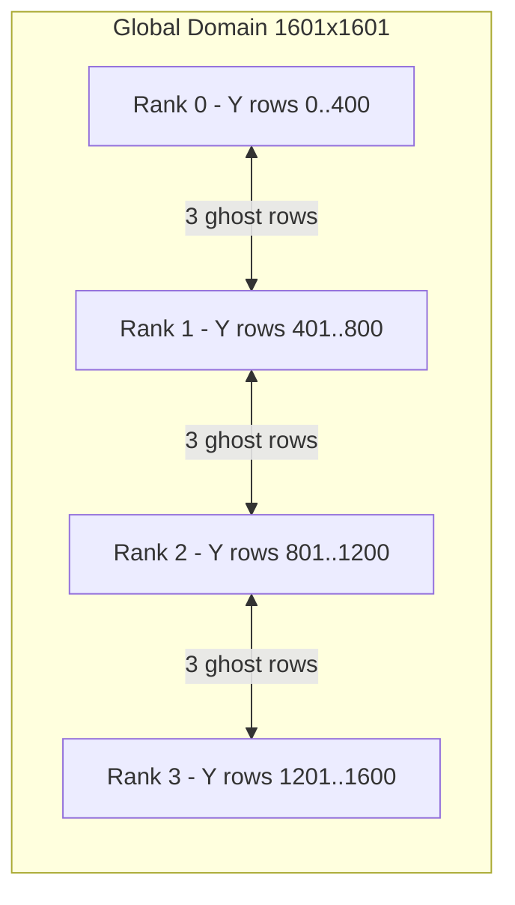

# G-Equation Level-Set Solver 2D (MPI) -- Code Structure Analysis

## 1. Project Overview

| Property | Value |
|---|---|
| **Purpose** | Solve the G-equation (level-set interface tracking) in 2D |
| **Parallelism** | MPI with 1D domain decomposition in Y-direction |
| **Spatial scheme** | WENO-5 (5th-order Weighted ENO) upwind |
| **Time integration** | TVD RK3 (3rd-order Shu-Osher) |
| **Reinitialization** | HCR-2 (Hartmann Conservative Reinitialization) |
| **Grid** | 1601x1601 structured, uniform spacing |
| **Domain** | [0, 1]^2 with Periodic BC (x) + Zero-gradient BC (y) |
| **Language** | C++14 with MPI |
| **Build** | Makefile with mpicxx |

### Governing Equation

dG/dt + u_eff . nabla G = 0, where u_eff = u - S_L * (nabla G / |nabla G|)

---

## 2. Directory Structure

```
level-set_MPI_2D/
├── Makefile                  # Build (mpicxx, -O3, C++14, -march=native)
├── include/
│   ├── config.h              # Grid 1601x1601, NGHOST=3, SimParams, MPI decomp
│   ├── weno5.h               # WENO-5 inline functions (dx, dy)
│   ├── rk3.h                 # TVD RK3 + RHS computation
│   ├── reinitialization.h    # HCR-2 with 4-neighbor detection
│   ├── boundary.h            # MPI ghost exchange (Y) + Periodic (X) + Neumann (Y edges)
│   ├── initial_conditions.h  # SDFs (pyramid, circle, Zalesak) + velocity fields
│   └── io.h                  # Binary I/O with MPI_Gatherv, VTK, error metrics
├── src/
│   ├── main.cpp              # CLI entry point, simulation loop
│   └── solver.cpp            # GEquationSolver class
├── scripts/                  # Python & MATLAB visualization
└── log/ & output/
```

---

## 3. Architecture Diagram



---

## 4. MPI Domain Decomposition



- 1D decomposition in Y-direction
- Non-blocking MPI_Isend/MPI_Irecv for ghost exchange
- Domain edges: zero-gradient (Neumann) BCs
- X-direction: periodic (local, no MPI)

---

## 5. Module Descriptions

### 5.1 `config.h` -- Configuration & MPI Decomposition
- Grid: NX=NY=1601, NGHOST=3, DX=DY=1/1600
- Physics: S_L=0.0, U_CONST=1.0, V_CONST=0.0
- Time: CFL=0.2, T_FINAL=2*pi
- SimParams: rank, num_procs, local_ny, y_start, neighbor_below/above
- setupMPIDomainDecomposition(): divides NY, NO periodic wrap

### 5.2 `weno5.h` -- WENO-5
- Same algorithm as GPU version, inline C++ functions
- weno5_left/right, weno5_dx/dy, weno5_gradient_magnitude

### 5.3 `rk3.h` -- TVD RK3
- computeRHS(): nested loop over interior, WENO-5 upwind derivatives
- rk3Stage1/2/3(): point-wise update over all local cells
- rk3TimeStep(): 3 stages with BCs after each

### 5.4 `reinitialization.h` -- HCR-2
- 4-neighbor interface detection (bits: 1=x-, 2=x+, 4=y-, 8=y+)
- reinitStep(): Godunov gradient + HCR-2 forcing + stability constraint
- reinitializeWithSwap(): multiple pseudo-time iterations

### 5.5 `boundary.h` -- BCs & MPI Communication
- exchangeGhostCells(): MPI_Isend/Irecv between Y-neighbors
- applyPeriodicBC_X(): local ghost copy
- applyZeroGradientBC_Y(): Neumann at domain Y-edges
- Combined: MPI exchange -> Periodic X -> Neumann Y

### 5.6 `initial_conditions.h` -- Test Cases
- Pyramid, Circle, Zalesak slotted disk SDFs
- Constant and rotating velocity fields

### 5.7 `io.h` -- I/O with MPI
- saveFieldBinary(): MPI_Gatherv to rank 0, reconstruct, write
- computeL2Error(): MPI_Allreduce(MPI_SUM)
- computeInterfaceArea(): MPI_Allreduce

---

## 6. Test Cases

| Test | Shape | Velocity | Purpose |
|---|---|---|---|
| **Pyramid** | Diamond at (0.5, 1.0) | (1, 0) constant | Pure advection |
| **Circle** | Circle at (0.25, 0.5) | (1, 0) constant | Convergence |
| **Zalesak** | Slotted disk at (0.5, 0.75) | Rotation | Corner preservation |

---

## 7. Performance

| Grid | Procs | Steps | Wall Time | Time/Step | Area Conservation |
|---|---|---|---|---|---|
| 1601x1601 | 32 | 50266 | 913.1 s | 18.2 ms | 99.977% |

---

## 8. Usage

```bash
make
mpirun -np 4 ./g_equation_solver -t zalesak -T 6.283185 -reinit
make test-scale   # scalability test with 1,2,4,8 processes
```
