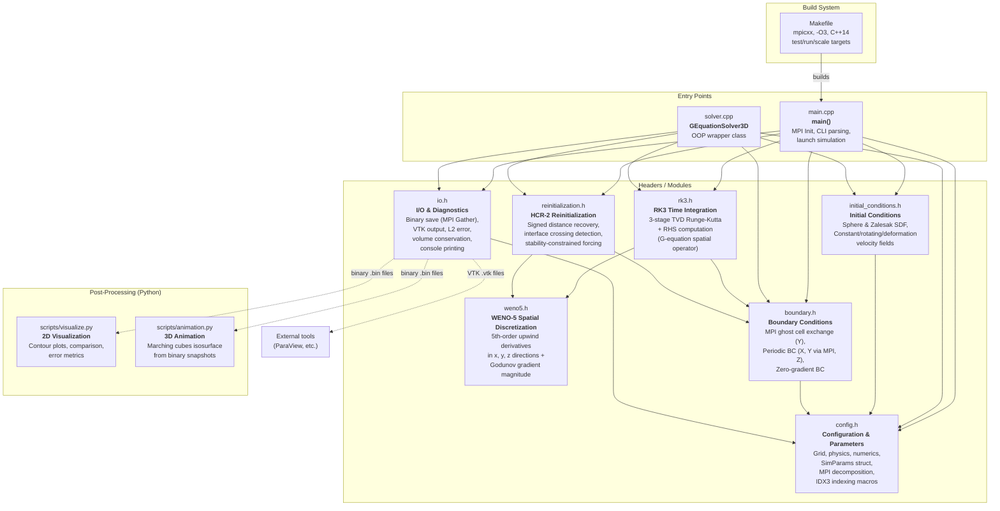
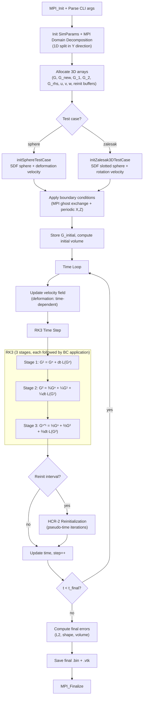
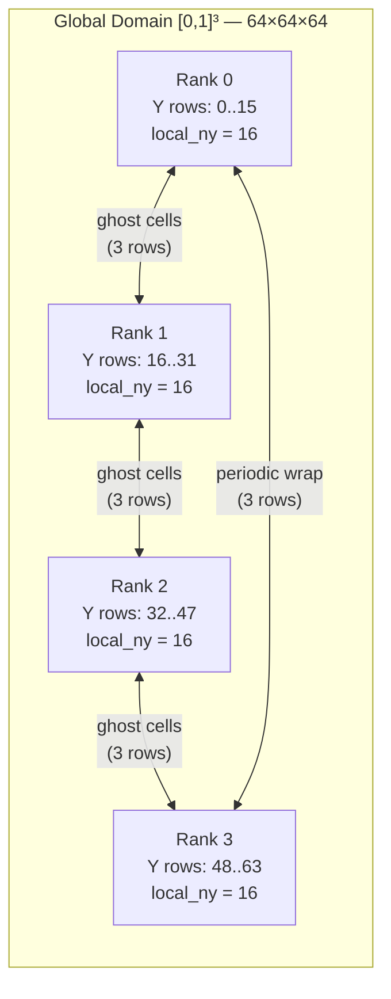
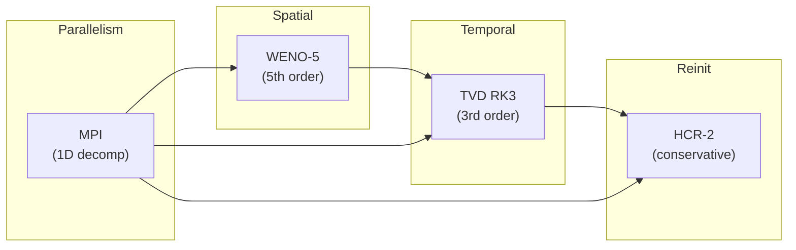

# G-Equation Level-Set Solver 3D (MPI) — Code Structure Analysis

This notebook documents the architecture, module responsibilities, data flow, and numerical methods of the **3D parallel level-set solver** for the G-equation with MPI domain decomposition.

---
## 1. Project Overview

| Property | Value |
|---|---|
| **Purpose** | Solve the G-equation (level-set interface tracking) in 3D |
| **Parallelism** | MPI with 1D domain decomposition in Y-direction |
| **Spatial scheme** | WENO-5 (5th-order Weighted ENO) upwind |
| **Time integration** | TVD RK3 (3rd-order Shu–Osher) |
| **Reinitialization** | HCR-2 (Hartmann Conservative Reinitialization) |
| **Grid** | 64×64×64 structured, uniform spacing |
| **Domain** | [0, 1]³ with periodic BCs in all directions |
| **Language** | C++14 with MPI, Python for post-processing |
| **Build** | Makefile with `mpicxx` |

### Governing Equation

$$
\frac{\partial G}{\partial t} + \mathbf{u}_{\text{eff}} \cdot \nabla G = 0
$$

where the effective velocity includes the laminar flame speed correction:

$$
\mathbf{u}_{\text{eff}} = \mathbf{u} - S_L \frac{\nabla G}{|\nabla G|}
$$

- $G < 0$: inside the interface (burned region)
- $G > 0$: outside the interface (unburned region)
- $G = 0$: the interface (flame front)

---
## 2. Directory Structure

```
level-set_MPI_3D/
├── Makefile                  # Build system (mpicxx, run/test targets)
├── g_equation_solver_3d      # Compiled binary
├── include/
│   ├── config.h              # Grid, physics, numerics, SimParams, MPI decomposition
│   ├── weno5.h               # WENO-5 spatial discretization
│   ├── rk3.h                 # TVD RK3 time integration + RHS operator
│   ├── reinitialization.h    # HCR-2 signed-distance recovery
│   ├── boundary.h            # BCs: MPI ghost exchange, periodic, Neumann
│   ├── initial_conditions.h  # SDFs, velocity fields, test cases
│   └── io.h                  # Binary/VTK I/O, error metrics, console output
├── src/
│   ├── main.cpp              # CLI entry point (procedural simulation loop)
│   └── solver.cpp            # OOP wrapper (GEquationSolver3D class)
├── scripts/
│   ├── visualize.py          # 2D contour plots & error metrics
│   └── animation.py          # 3D marching-cubes isosurface animation
├── output/                   # Binary & VTK output files
└── log/                      # Simulation log files
```

---
## 3. Architecture Diagram — Module Dependencies



---
## 4. Simulation Flow Diagram



---
## 5. MPI Domain Decomposition Diagram



- **Decomposition**: 1D in Y-direction only. Each process owns `local_ny` interior rows plus `2 × NGHOST = 6` ghost rows.
- **Communication**: Non-blocking `MPI_Isend`/`MPI_Irecv` with buffer pack/unpack (Y-slabs are non-contiguous in memory).
- **Periodicity**: Last rank and first rank exchange ghost cells (wrap-around neighbors).
- **X and Z**: Handled locally with periodic ghost cell copy (no MPI needed).

---
## 6. Module Descriptions

### 6.1 `config.h` — Configuration & Simulation Parameters

**File**: `include/config.h`

**Purpose**: Central configuration file defining all compile-time constants and the runtime parameter structure.

**Key contents**:

| Component | Description |
|---|---|
| **Grid constants** | `NX=NY=NZ=64`, `NGHOST=3` (required by WENO-5 stencil), `NX_TOTAL=70` |
| **Domain** | `[0, 1]³`, uniform spacing `DX = DY = DZ = 1/63` |
| **Physics** | `S_L=0.0` (flame speed), `U/V/W_CONST=0.0` (default velocities) |
| **Time** | `DT=0.001` (fixed), `CFL=0.2`, `T_FINAL=1.5`, `MAX_STEPS=10⁶` |
| **Reinitialization** | `ENABLE_REINIT=false`, `REINIT_INTERVAL=10`, `REINIT_ITERATIONS=2`, `REINIT_DTAU_FACTOR=0.25`, `REINIT_BETA=0.5` |
| **`SimParams` struct** | Runtime container for all parameters including MPI rank/size, local grid dimensions, neighbor ranks |
| **`setupMPIDomainDecomposition()`** | Divides NY rows among processes (handles remainder), sets periodic Y-neighbors |
| **`calculateTimeStep()`** | Returns fixed DT if set, otherwise computes `CFL × min(dx,dy,dz) / max_speed` |
| **`IDX3` / `idx3()`** | 3D→1D index mapping: `k × nx_total × ny_total + j × nx_total + i` (x-fastest) |
| **`indexToCoord3D()`** | Local grid index → physical (x, y, z) coordinate with MPI y-offset |

### 6.2 `weno5.h` — 5th-Order WENO Spatial Discretization

**File**: `include/weno5.h`

**Purpose**: Compute high-order upwind spatial derivatives using the WENO-5 scheme (Jiang & Shu, 1996).

**Algorithm**:

1. **Smoothness indicators** ($\beta_k$): Measure oscillation in each of the three candidate stencils:
$$
\beta_k = \frac{13}{12}(v_{i} - 2v_{i+1} + v_{i+2})^2 + \frac{1}{4}(v_{i+2} - v_i)^2
$$

2. **Nonlinear weights** ($\omega_k$): Adapt ideal weights $d_k = (0.1, 0.6, 0.3)$ based on smoothness:
$$
\alpha_k = \frac{d_k}{(\epsilon + \beta_k)^2}, \quad \omega_k = \frac{\alpha_k}{\sum \alpha_k}
$$

3. **Reconstruction**: Weighted combination of three 3rd-order polynomials.

**Key functions**:

| Function | Description |
|---|---|
| `weno5_left(v[5])` | Left-biased reconstruction at cell interface from 5 values |
| `weno5_right(v[5])` | Right-biased reconstruction (mirrors stencil, swaps weights) |
| `weno5_dx_3d()` | Upwind x-derivative: uses `weno5_left` if `u_eff ≥ 0`, `weno5_right` otherwise |
| `weno5_dy_3d()` | Upwind y-derivative (same logic for v-direction) |
| `weno5_dz_3d()` | Upwind z-derivative (same logic for w-direction) |
| `weno5_gradient_magnitude_3d()` | Godunov-scheme gradient magnitude for reinitialization using one-sided differences |

### 6.3 `rk3.h` — 3rd-Order TVD Runge-Kutta Time Integration

**File**: `include/rk3.h`

**Purpose**: Advance the G-field one time step using the TVD RK3 scheme (Shu & Osher, 1988).

**RK3 stages**:

$$
\begin{aligned}
G^{(1)} &= G^n + \Delta t \, L(G^n) \\
G^{(2)} &= \tfrac{3}{4} G^n + \tfrac{1}{4} G^{(1)} + \tfrac{1}{4} \Delta t \, L(G^{(1)}) \\
G^{n+1} &= \tfrac{1}{3} G^n + \tfrac{2}{3} G^{(2)} + \tfrac{2}{3} \Delta t \, L(G^{(2)})
\end{aligned}
$$

**Spatial operator** $L(G)$ computed in `computeRHS3D()`:
1. Compute central-difference gradient $\nabla G$ for flame speed normal direction
2. Form effective velocity: $u_{\text{eff}} = u - S_L \, \nabla G / |\nabla G|$
3. Compute WENO-5 upwind derivatives $\partial G / \partial x$, $\partial G / \partial y$, $\partial G / \partial z$
4. Return $L(G) = -(u_{\text{eff}} \cdot \nabla G)$

**Important**: Boundary conditions are applied after **every** RK stage to ensure ghost cells are valid for the next stage's stencil evaluation.

### 6.4 `reinitialization.h` — HCR-2 Reinitialization

**File**: `include/reinitialization.h`

**Purpose**: Restore the level-set function $G$ to a signed distance function ($|\nabla G| = 1$) while preserving the zero-contour location.

**HCR-2 equation** (Hartmann et al., 2010, Eq. 15):

$$
\frac{\partial \phi}{\partial \tau} + S(\phi_0)(|\nabla \phi| - 1) = \beta \, F
$$

where $S(\phi_0) = \phi_0 / \sqrt{\phi_0^2 + \Delta x^2}$ is the smoothed sign function.

**Three-phase algorithm**:

| Phase | Function | Description |
|---|---|---|
| **1. Pre-compute** | `computeInterfaceCrossings3D()` | Detect cells near interface by checking sign changes with all 6 neighbors. Encode neighbor flags as bits (1=x⁻, 2=x⁺, 4=y⁻, 8=y⁺, 16=z⁻, 32=z⁺). Compute $\tilde{r} = \phi_c / \sum \phi_{\text{neighbors}}$. |
| **2. Iterate** | `reinitStep3D()` | Euler step in pseudo-time: compute Godunov gradient magnitude, evaluate HCR-2 forcing $F = \beta(\tilde{r} \sum \phi_n - \phi) / \Delta x$ with stability constraint (no sign changes allowed). |
| **3. Orchestrate** | `reinitializeWithSwap3D()` | Save $\phi_0$, run `reinit_iterations` steps with pointer swapping, apply BCs after each iteration. |

### 6.5 `boundary.h` — Boundary Conditions & MPI Communication

**File**: `include/boundary.h`

**Purpose**: Apply boundary conditions and exchange ghost cell data between MPI processes.

**Boundary condition types**:

| Direction | Type | Implementation |
|---|---|---|
| **X** | Periodic | Local ghost cell copy: `G[ghost] = G[interior_opposite]` |
| **Y** | Periodic via MPI | Ghost exchange between neighbor ranks (wrap-around at domain edges) |
| **Z** | Periodic | Local ghost cell copy |

**MPI ghost exchange** (`exchangeGhostCells3D`):
1. **Pack** `NGHOST` boundary Y-slabs into contiguous send buffers (needed because Y-slabs are non-contiguous in the `(k, j, i)` memory layout)
2. **Non-blocking send/receive** using `MPI_Isend` / `MPI_Irecv` with tag-based matching
3. **Wait** with `MPI_Waitall`
4. **Unpack** received data into ghost cell regions

The combined `applyBoundaryConditions3D()` calls MPI exchange first (Y), then local periodic copies (X, Z). Velocity BCs simply apply the same function to each component (u, v, w).

### 6.6 `initial_conditions.h` — Initial Conditions & Velocity Fields

**File**: `include/initial_conditions.h`

**Purpose**: Generate signed distance fields (SDFs) for test geometries and define velocity fields for advection.

#### Signed Distance Functions

| Shape | Formula | Parameters |
|---|---|---|
| **Sphere** | $G = \sqrt{(x-c_x)^2 + (y-c_y)^2 + (z-c_z)^2} - r$ | Center (0.35, 0.35, 0.35), $r=0.15$ |
| **Zalesak sphere** | $G = \max(G_{\text{sphere}}, -G_{\text{slot}})$ | Center (0.5, 0.75, 0.5), $r=0.15$, slot 0.05×0.05×0.25 |

#### Velocity Fields

| Field | Equations | Usage |
|---|---|---|
| **Constant** | $u = U_0, \; v = V_0, \; w = W_0$ | Simple advection tests |
| **Rotating** | $u = -\omega(y - y_c), \; v = \omega(x - x_c), \; w = 0$ | Zalesak rotation around z-axis |
| **3D Deformation** | $u = 2\sin^2(\pi x)\sin(2\pi y)\sin(2\pi z)\cos(\pi t/T)$ | Sphere deformation test |
| | $v = -\sin(2\pi x)\sin^2(\pi y)\sin(2\pi z)\cos(\pi t/T)$ | (divergence-free, |
| | $w = -\sin(2\pi x)\sin(2\pi y)\sin^2(\pi z)\cos(\pi t/T)$ | time-reversible) |

The deformation test stretches the sphere to maximum deformation at $t = T/2$, then reverses back to the original shape at $t = T$. This tests both advection accuracy and volume conservation.

### 6.7 `io.h` — I/O, Error Metrics & Console Output

**File**: `include/io.h`

**Purpose**: Handle all file output (binary, VTK), compute error metrics with MPI reductions, and format console output.

#### Binary I/O (`saveFieldBinary3D`)
- Each process sends interior Y-rows (excluding ghost cells) to rank 0 via `MPI_Gatherv`
- Rank 0 reconstructs the full global array, fills ghost cells, and writes:
  - Header: `int32[4]` → (nx, ny, nz, nghost)
  - Data: `float64[nx_total × ny_total × nz_total]` (full array with ghost cells)

#### VTK Output (`saveFieldVTK3D`)
- Same MPI gather pattern
- Writes ASCII VTK Structured Points format (interior points only)
- Compatible with ParaView, VisIt, and other VTK-based tools

#### Error Metrics (computed via `MPI_Allreduce`)

| Metric | Function | Formula |
|---|---|---|
| **L2 Error** | `computeL2Error3D()` | $\sqrt{\frac{1}{N} \sum (G - G_{\text{ref}})^2}$ |
| **Interface Volume** | `computeInterfaceVolume()` | $\sum_{G<0} \Delta x \, \Delta y \, \Delta z$ |
| **Shape Error** | `computeMeanShapeError3D()` | $|V_{\text{final}} - V_{\text{initial}}| / V_{\text{initial}}$ |

### 6.8 `main.cpp` — Main Entry Point (Procedural)

**File**: `src/main.cpp`

**Purpose**: Parse command-line arguments, initialize MPI, and run the simulation in a procedural style.

**Command-line options**:

| Flag | Description | Default |
|---|---|---|
| `-t <test>` | Test case: `sphere` or `zalesak` | `sphere` |
| `-T <time>` | Final simulation time | 1.5 |
| `-cfl <val>` | CFL number | 0.2 |
| `-sl <val>` | Laminar flame speed $S_L$ | 0.0 |
| `-u/-v/-w <val>` | Velocity components | 0.0 |
| `-reinit` / `-no-reinit` | Enable/disable reinitialization | disabled |
| `-ri <N>` | Reinit interval (steps) | 10 |
| `-riter <N>` | Reinit pseudo-time iterations | 2 |
| `-o <dir>` | Output directory | `./output` |

**Flow**: `MPI_Init` → `parseCommandLine` → `mkdir` (rank 0) → `MPI_Barrier` → `runStandaloneSimulation3D` → `MPI_Finalize`

The `runStandaloneSimulation3D()` function contains the full procedural simulation loop including memory allocation, initialization, time-stepping, progress output, error computation, file saving, and cleanup.

### 6.9 `solver.cpp` — OOP Solver Wrapper

**File**: `src/solver.cpp`

**Purpose**: Provides an object-oriented interface (`GEquationSolver3D` class) wrapping the same numerical methods.

**Class interface**:

| Method | Description |
|---|---|
| `setupMPI(rank, num_procs)` | Configure MPI domain decomposition |
| `setParameters(params)` | Override simulation parameters |
| `allocateMemory()` | Allocate all 3D arrays (13 arrays per process) |
| `initializeSphereTest()` | Set up sphere deformation test |
| `initializeZalesakTest()` | Set up Zalesak rotation test |
| `step()` | Advance one time step (RK3 + optional reinit) |
| `run()` | Full simulation loop until `t_final` |
| `saveField(filename)` | Save current G to binary |
| `saveFieldAsVTK(filename)` | Save current G to VTK |
| `getL2Error()` | Get current L2 error vs initial |
| `getInterfaceVolume()` | Get current enclosed volume |
| `cleanup()` | Deallocate all memory |

A convenience function `runSimulation3D(test_case, save_output, rank, num_procs)` creates a solver instance and runs the full simulation.

### 6.10 `scripts/visualize.py` — 2D Post-Processing Visualization

**File**: `scripts/visualize.py`

**Purpose**: Read solver binary outputs and generate 2D plots using matplotlib.

**Capabilities**:
- **Single field plot**: Filled contour with `RdBu_r` colormap centered at zero, G=0 interface highlighted in black
- **Comparison plot**: Side-by-side initial vs. final vs. difference
- **Interface overlay**: Blue dashed (initial) vs. red solid (final) zero-contours
- **Error metrics**: L2 error, L∞ error, area conservation percentage

**Note**: This script reads the older 2D binary format (`int[3]: nx, ny, nghost`), not the 3D format. It would need updating for full 3D slice visualization.

### 6.11 `scripts/animation.py` — 3D Isosurface Animation

**File**: `scripts/animation.py`

**Purpose**: Animate the time evolution of the G=0 isosurface from sequential binary snapshots.

**Pipeline**:
1. Scan output directory for `G_step_NNNNNN.bin` files and sort by step number
2. For each frame:
   - Read 3D binary: header `int32[4]` (nx, ny, nz, nghost) + `float64` field data
   - Reshape to `(nz_total, ny_total, nx_total)` and strip ghost cells
   - Extract G=0 isosurface using **marching cubes** (`skimage.measure.marching_cubes`)
   - Render as `Poly3DCollection` in matplotlib 3D axes
3. Animate with `plt.pause(0.1)` between frames

**Dependencies**: `numpy`, `matplotlib`, `scikit-image`

### 6.12 `Makefile` — Build System

**File**: `Makefile`

**Compiler**: `mpicxx` with `-O3 -std=c++14 -Wall -Wextra -march=native`

**Key targets**:

| Target | Description |
|---|---|
| `make` / `make all` | Build `g_equation_solver_3d` |
| `make debug` | Build with `-g -O0 -DDEBUG` |
| `make run` | Run with NP=4 MPI processes (configurable: `make NP=8 run`) |
| `make test` | Sphere advection, T=1.0, no reinit |
| `make test-reinit` | Sphere with reinitialization |
| `make test-zalesak` | Zalesak slotted sphere rotation (T=2π) |
| `make test-quick` | Short run (T=0.1) for quick validation |
| `make test-single` | Single process (NP=1) for debugging |
| `make test-scale` | Scalability test with NP=1,2,4,8 |
| `make clean` | Remove binary and output files |

---
## 7. Memory Layout & Data Arrays

### 3D Array Indexing

All 3D fields use a flat 1D array with **row-major** (x-fastest) ordering:

$$
\text{index} = k \times N_x^{\text{total}} \times N_y^{\text{local\_total}} + j \times N_x^{\text{total}} + i
$$

### Arrays Allocated Per Process

| Array | Type | Purpose |
|---|---|---|
| `G` | `double[]` | Current level-set field |
| `G_new` | `double[]` | Next time step (swapped with G) |
| `G_1`, `G_2` | `double[]` | RK3 intermediate stages |
| `G_rhs` | `double[]` | Right-hand side $L(G)$ |
| `G_initial` | `double[]` | Stored initial field for error computation |
| `u`, `v`, `w` | `double[]` | Velocity field components |
| `G_reinit_temp` | `double[]` | Reinitialization swap buffer |
| `G_reinit_0` | `double[]` | Pre-reinitialization field $\phi_0$ |
| `r_tilde` | `double[]` | HCR-2 ratio for forcing term |
| `interface_flag` | `int[]` | Bit flags for interface-crossing neighbors |

**Total**: 12 `double` arrays + 1 `int` array per process, each of size $N_x^{\text{total}} \times N_y^{\text{local\_total}} \times N_z^{\text{total}}$.

---
## 8. Numerical Method Summary



| Aspect | Method | Order | Reference |
|---|---|---|---|
| Spatial discretization | WENO-5 (upwind) | 5th | Jiang & Shu, 1996 |
| Time integration | TVD Runge-Kutta | 3rd | Shu & Osher, 1988 |
| Reinitialization | HCR-2 + Godunov gradient | — | Hartmann et al., 2010 |
| Flame speed normal | Central difference | 2nd | — |
| CFL condition | $\Delta t \leq \text{CFL} \times \min(\Delta x, \Delta y, \Delta z) / u_{\max}$ | — | — |

---
## 9. Test Cases

### 9.1 Sphere Deformation Test

- **Initial shape**: Sphere at (0.35, 0.35, 0.35) with radius 0.15
- **Velocity**: 3D time-reversible vortex (deformation field)
- **Expected**: Sphere deforms into thin filament at $t = T/2$, returns to sphere at $t = T$
- **Validation**: L2 error and volume conservation at $t = T$

### 9.2 Zalesak's Slotted Sphere Rotation

- **Initial shape**: Sphere with rectangular slot at (0.5, 0.75, 0.5), radius 0.15
- **Velocity**: Rigid-body rotation around z-axis, period $T = 2\pi / \omega$
- **Expected**: Shape returns to starting position after one full rotation
- **Validation**: Shape preservation (sharp corners of slot) and volume conservation

---
## 10. Usage Examples

```bash
# Build
make

# Run sphere deformation test with 4 MPI processes
mpirun -np 4 ./g_equation_solver_3d -t sphere -T 1.5 -reinit

# Run Zalesak test with 8 processes
mpirun -np 8 ./g_equation_solver_3d -t zalesak -T 6.283185 -reinit

# Quick validation (short run, no reinit)
mpirun -np 4 ./g_equation_solver_3d -t sphere -T 0.1 -no-reinit

# Visualize results
python scripts/animation.py
```
