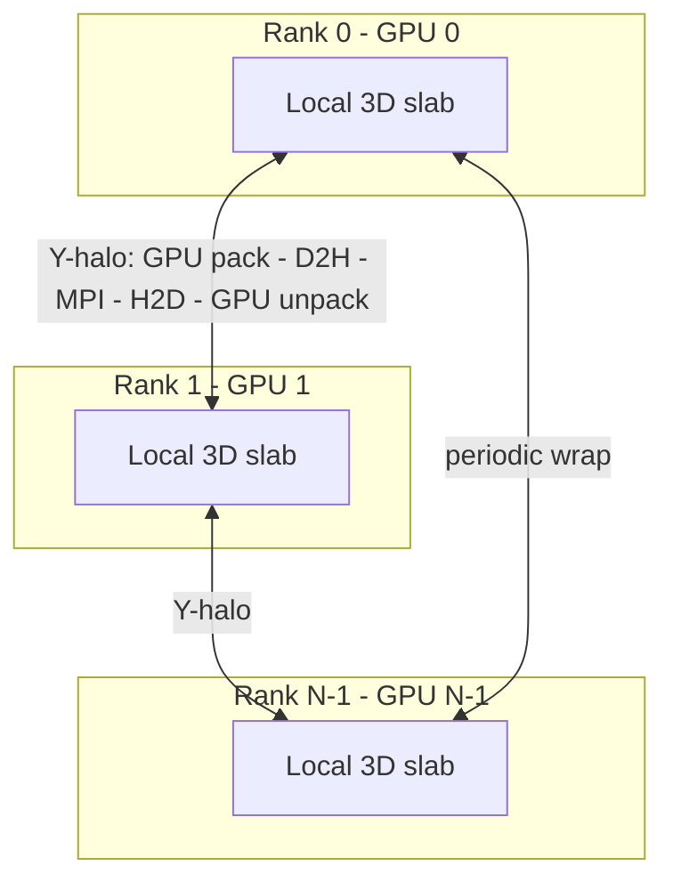
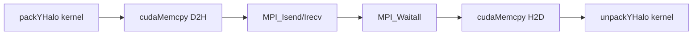

# G-Equation Level-Set Solver 3D (MPI + GPU) -- Code Structure Analysis

## 1. Project Overview

| Property | Value |
|---|---|
| **Purpose** | Solve the G-equation (level-set interface tracking) in 3D |
| **Parallelism** | MPI + CUDA hybrid (multi-GPU), 1D Y-decomposition |
| **Spatial scheme** | WENO-5 (5th-order Weighted ENO) upwind |
| **Time integration** | TVD RK3 (3rd-order Shu-Osher) |
| **Reinitialization** | Not included |
| **Grid** | 64x64x64 structured, uniform spacing |
| **Domain** | [0, 1]^3, periodic in all directions |
| **Language** | CUDA C++14 with MPI |
| **Build** | Makefile with nvcc + g++-9 + MPI |

---

## 2. Directory Structure

```
level-set_MPI_GPU_3D/
├── Makefile                        # Build (nvcc sm_86 + MPI auto-detect)
├── include/
│   ├── config.cuh                  # Grid, params, MPI decomp, CUDA 8^3
│   ├── weno5.cuh                   # WENO-5 3D device functions
│   ├── rk3.cuh                     # RK3 3D kernels + RHS
│   ├── boundary.cuh                # MPI halo exchange + periodic X,Z
│   └── initial_conditions.cuh      # Sphere SDF + deformation velocity
├── src/
│   └── main.cu                     # Full MPI+CUDA driver + I/O
├── scripts/
│   ├── animation.py                # Python 3D marching cubes
│   └── animation.m                 # MATLAB 3D visualization
└── log/
```

No reinitialization module -- focuses on pure advection accuracy.

---

## 3. MPI + GPU Hybrid Architecture



### Halo Exchange Pipeline



---

## 4. Module Descriptions

### 4.1 `config.cuh`
- Grid: NX=NY=NZ=64, NGHOST=3, DT=0.001, T_FINAL=1.5
- SimParams: LOCAL dimensions (ny=local_ny), global_ny for I/O
- GPU assignment: device_id = rank % num_devices

### 4.2 `weno5.cuh`
- Same WENO-5 as single-GPU: weno5_dx, weno5_dy, weno5_dz

### 4.3 `rk3.cuh`
- computeRHS, rk3Stage1/2/3 kernels (local grid only)
- rk3TimeStep(): stages + BCs after each

### 4.4 `boundary.cuh`
- **Local**: applyPeriodicBC_X_3D, applyPeriodicBC_Z_3D (GPU kernels)
- **MPI halo (Y)**: HaloBuffers struct with device + pinned host buffers
  - packYHalo/unpackYHalo GPU kernels
  - MPI_Isend/Irecv (4 non-blocking messages, periodic wrap)

### 4.5 `initial_conditions.cuh`
- Sphere: (0.35, 0.35, 0.35), r=0.15
- Deformation velocity: time-reversible 3D vortex

### 4.6 `main.cu`
- MPI_Init -> cudaSetDevice -> SimParams + decomp -> cudaMalloc + halo buffers
- I/O: MPI_Gatherv -> reconstruct -> binary save (int[4] header + full array)
- Global reductions: MPI_Allreduce for volume and L2 error

---

## 5. Performance

| Ranks | Grid | Steps | L2 Error | Volume Change | Wall Time | Time/Step |
|---|---|---|---|---|---|---|
| 2 | 64^3 | 1501 | 9.16e-4 | 0.56% | 22.5 s | 15.0 ms |

---

## 6. Usage

```bash
make CUDA_ARCH=sm_86
mpirun -np 2 ./g_equation_solver_mpi_gpu
python scripts/animation.py
```
